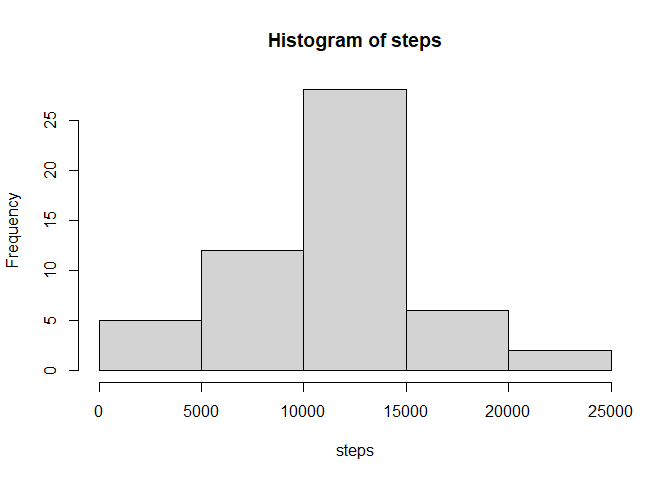

## Loading and preprocessing the data

```r
activity <- read.csv("activity.csv")

#Convert date column to Date format
activity$date <- as.Date(activity$date, "%Y-%m-%d")
```

## What is mean total number of steps taken per day?

```r
steps <- aggregate(steps ~ date, activity, FUN=sum)$steps
hist(steps)
```

<!-- -->

```r
mean(steps)
```

```
## [1] 10766.19
```

```r
median(steps)
```

```
## [1] 10765
```
mean: 10766.19  
median: 10765

## What is the average daily activity pattern?

```r
avg.steps.intervals <- aggregate(steps ~ interval, activity, FUN=mean)
with(avg.steps.intervals, plot(interval, steps, type="l"))
```

<!-- -->

```r
#Find the interval with maximum steps
avg.steps.intervals[which.max(avg.steps.intervals$steps),'interval']
```

```
## [1] 835
```

Maximum number of steps at interval 835

## Imputing missing values

```r
sum(is.na(activity))
```

```
## [1] 2304
```

```r
#Replacing NAs with mean of daily intervals
#Index all na value
index <- is.na(activity)
#Get the interval for each NA
int <- activity[index,'interval']
#Find the value of the steps for each intervals
value <- avg.steps.intervals[avg.steps.intervals$interval %in% int, 'steps']
#Replace the NAs with value obtained
activity2 <- replace(activity, index, value)

steps2 <- aggregate(steps ~ date, activity2, FUN=sum)$steps
hist(steps2)
```

<!-- -->

```r
mean(steps2)
```

```
## [1] 10766.19
```

```r
median(steps2)
```

```
## [1] 10766.19
```

Total number of missing values: 2304  

mean: 10766.19  
median: 10766.19  
Impact: The values are very close to the previous estimate. It seems to have little to no difference.

## Are there differences in activity patterns between weekdays and weekends?

```r
#creating Weekday and Weekend factors
days <- weekdays(activity2$date)
weekdays1 <- c('Monday', 'Tuesday', 'Wednesday', 'Thursday', 'Friday')
weekdays <- factor(days %in% weekdays1,  
                   levels=c(FALSE, TRUE), labels=c('Weekend', 'Weekday'))

#Re-aggregating data with factors
week.activity2 <- cbind(activity2, weekdays)
week.activity2 <- aggregate(steps ~ weekdays + interval, week.activity2, mean)

#Plotting with lattice
with(week.activity2,
     lattice::xyplot(steps~interval|weekdays,
                     type="l",
                     ylab="Steps", xlab="Interval",
                     layout=c(1,2))
     )
```

<!-- -->
